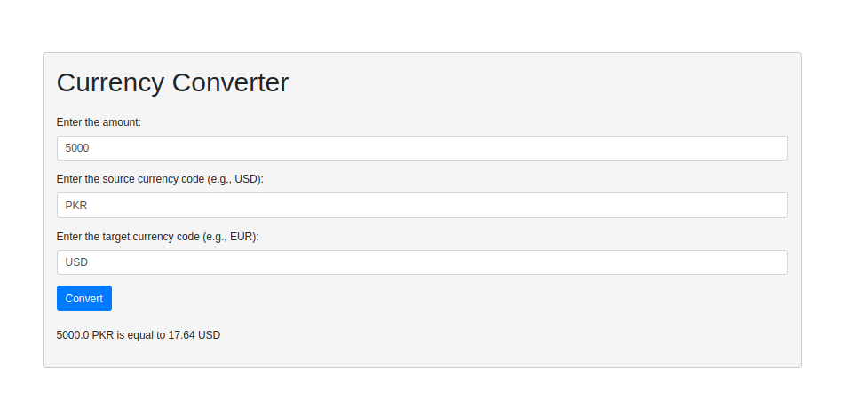

This program offers a simple web-based currency converter. The user can input an amount and select a source and target currency. The program then uses an API to fetch the current exchange rates and calculate the converted amount. The result is displayed on the webpage. The user interface is built with HTML and Bootstrap for styling. The server-side logic is implemented in Python using the Flask web framework.

#huggingfacelink
https://huggingface.co/spaces/fahad56/currency_converter

